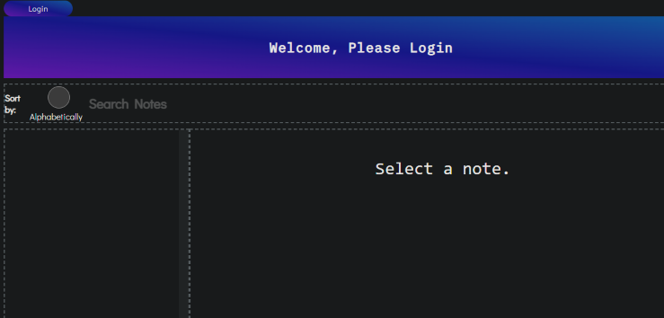

# Phase 2 Evernote Project

This project puts together all I learned in JSX and further builds on my JS knowledge and skills.

 

## Overview
-----------------------------
This project is a single page application that is similar to using Evernote.

The home screen looks as below.

## Usage
----------------------------------
As a user I can:

- Login/Logout
- Select a note to display
- Create a new note
- Edit and delete a note
- Sort notes alphabetically by title
- Search for a given note by title

## License
--------------------------------
[MIT](https://choosealicense.com/licenses/mit/)